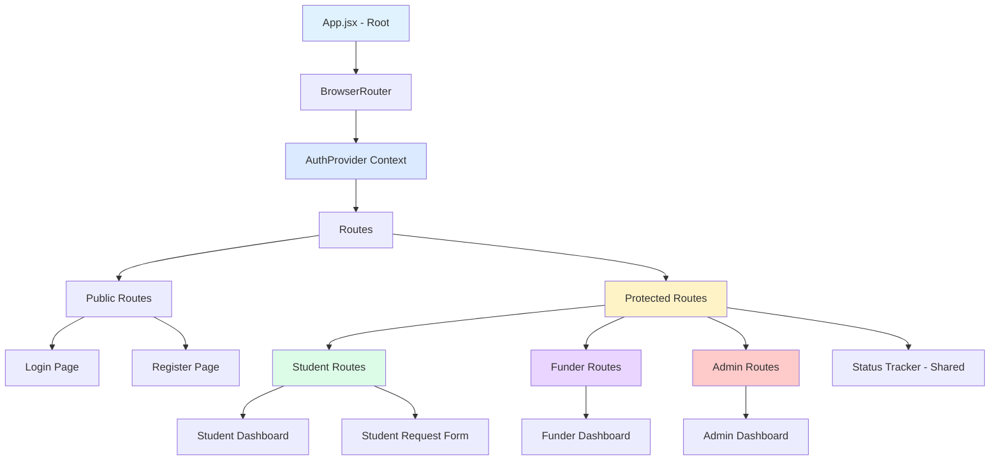
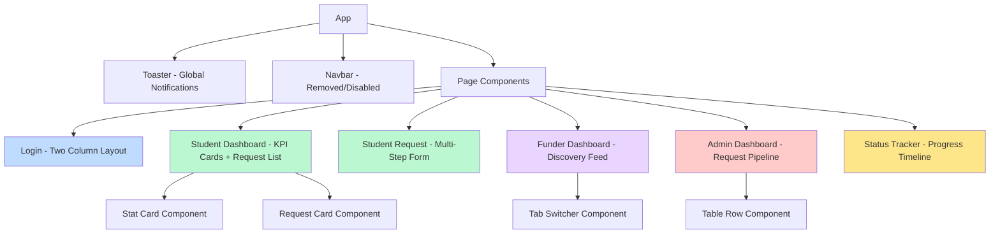
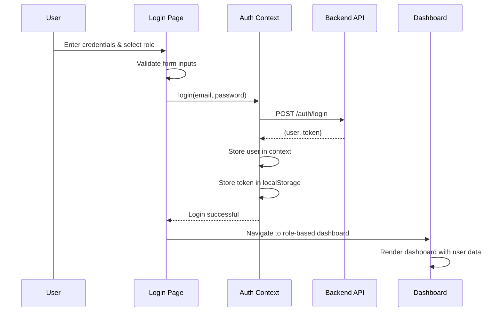
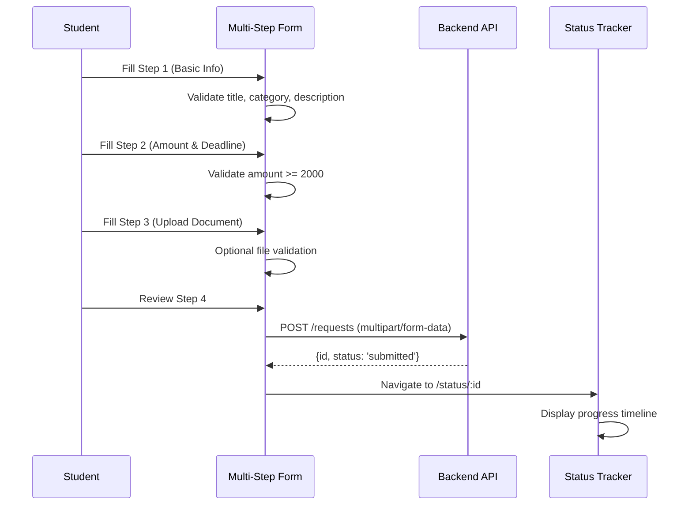
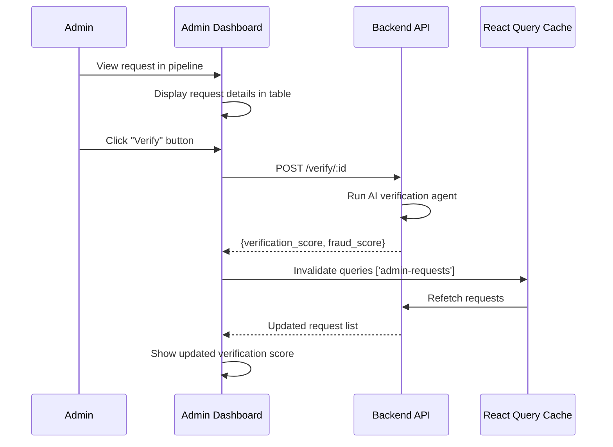
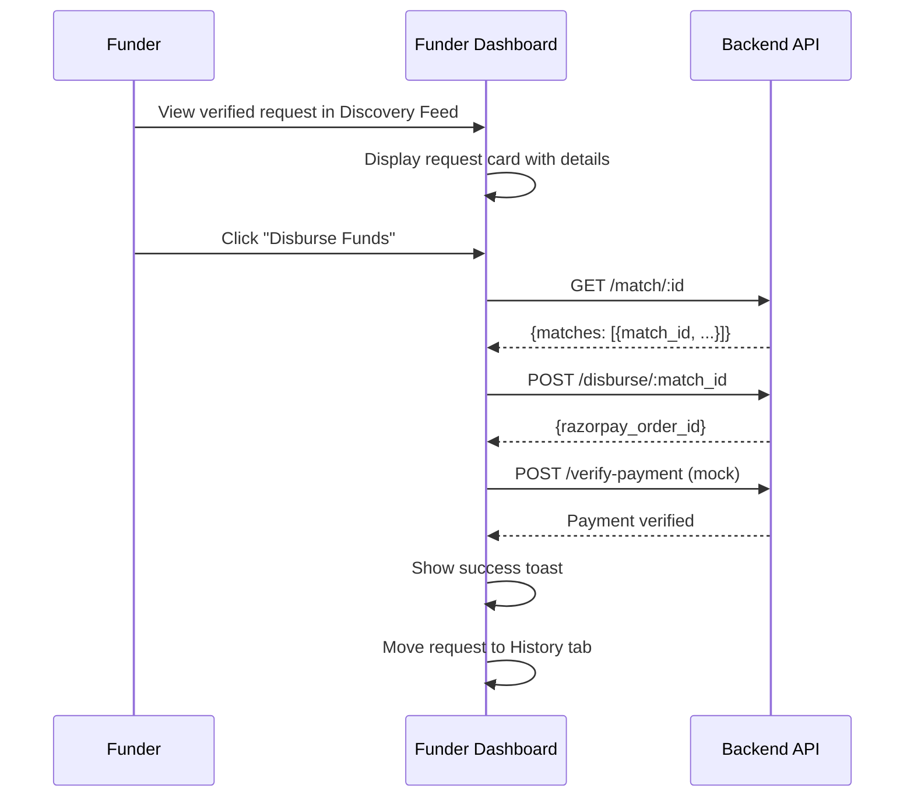

# Design Document: VidyaFund AI Frontend Refactoring

## Overview

This design document outlines a comprehensive UI/UX refactoring of the VidyaFund AI frontend to transform it from a hackathon prototype into a professional, investor-ready SaaS product. The refactoring focuses exclusively on visual polish, design system consistency, and user experience improvements without adding new features, widgets, analytics, or charts.

**Key Principles:**
- **Whitespace First**: Generous spacing between components for visual breathing room
- **Minimal Borders**: Use shadows and backgrounds instead of heavy borders
- **Consistent Typography**: Clear hierarchy with Inter font throughout
- **Professional Polish**: Inspired by Linear, Stripe, Notion, and Vercel
- **Trust & Simplicity**: Clean, modern aesthetics that inspire confidence

**Scope:**
- 6 pages: Login/Register, Student Dashboard, Student Request Form, Funder Dashboard, Admin Dashboard, Status Tracker
- 2 components: Navbar (to be removed/simplified), ProtectedRoute (no changes needed)
- Global design system implementation using TailwindCSS and shadcn/ui

**Technology Stack:**
- React 19.2.6 + Vite
- TailwindCSS 4.3.1 for styling
- TypeScript/JavaScript for component logic
- Lucide React for icons
- Framer Motion for animations
- React Hot Toast for notifications
- Recharts for charts (minimal usage)


## Architecture

The frontend follows a standard React SPA architecture with role-based routing and authentication. The refactoring maintains this architecture while improving component structure and styling patterns.




### Component Hierarchy




## Components and Interfaces

### Global Design System

#### Typography System

```typescript
// Typography hierarchy using TailwindCSS classes
interface TypographyScale {
  pageTitle: string;      // "text-3xl font-bold text-gray-900"
  sectionTitle: string;   // "text-xl font-semibold text-gray-800"
  cardTitle: string;      // "text-base font-medium text-gray-900"
  bodyText: string;       // "text-sm text-gray-600"
  metadata: string;       // "text-sm text-gray-500" (muted-foreground)
  caption: string;        // "text-xs text-gray-400"
}

const typography: TypographyScale = {
  pageTitle: "text-3xl font-bold text-gray-900",
  sectionTitle: "text-xl font-semibold text-gray-800",
  cardTitle: "text-base font-medium text-gray-900",
  bodyText: "text-sm text-gray-600",
  metadata: "text-sm text-gray-500",
  caption: "text-xs text-gray-400"
};
```

**Font Configuration:**
- Primary font: Inter (already configured via Tailwind)
- Font weights: 400 (regular), 500 (medium), 600 (semibold), 700 (bold)
- Line heights: Default Tailwind scale (relaxed for body text)


#### Spacing System

```typescript
// Consistent spacing scale using p-6, gap-6, space-y-6
interface SpacingScale {
  tight: string;      // "gap-3 space-y-3" - for compact layouts
  default: string;    // "gap-6 space-y-6 p-6" - standard spacing
  relaxed: string;    // "gap-8 space-y-8 p-8" - for major sections
}

const spacing: SpacingScale = {
  tight: "gap-3 space-y-3",
  default: "gap-6 space-y-6 p-6",
  relaxed: "gap-8 space-y-8 p-8"
};

// Component spacing rules
const spacingRules = {
  cards: "p-6 rounded-xl",
  sections: "space-y-6",
  grids: "gap-6",
  containers: "max-w-6xl mx-auto px-6 py-8"
};
```

**Spacing Guidelines:**
- Never place components directly adjacent (minimum gap-3)
- Use whitespace instead of borders to separate sections
- Consistent padding: cards use p-6, containers use px-6 py-8
- Grid gaps: always gap-6 for major grids, gap-3 for tight groups


#### Color System

```typescript
// Semantic color palette using TailwindCSS
interface ColorSystem {
  primary: {
    base: string;      // Blue - "bg-blue-600 text-white"
    hover: string;     // "hover:bg-blue-700"
    light: string;     // "bg-blue-50 text-blue-700"
  };
  success: {
    base: string;      // Green - "bg-emerald-600 text-white"
    light: string;     // "bg-emerald-50 text-emerald-700"
  };
  warning: {
    base: string;      // Orange - "bg-amber-600 text-white"
    light: string;     // "bg-amber-50 text-amber-700"
  };
  danger: {
    base: string;      // Red - "bg-red-600 text-white"
    light: string;     // "bg-red-50 text-red-700"
  };
  ai: {
    base: string;      // Purple - "bg-purple-600 text-white"
    light: string;     // "bg-purple-50 text-purple-700"
  };
  neutral: {
    bg: string;        // "bg-gray-50"
    card: string;      // "bg-white"
    border: string;    // "border-gray-200"
    text: string;      // "text-gray-900"
    muted: string;     // "text-gray-500"
  };
}

const colors: ColorSystem = {
  primary: {
    base: "bg-blue-600 text-white",
    hover: "hover:bg-blue-700",
    light: "bg-blue-50 text-blue-700 border-blue-200"
  },
  // ... (rest of colors follow same pattern)
};
```

**Color Usage Rules:**
- Use colors sparingly and only for meaning
- Status badges: submitted=amber, verified=indigo, matched=blue, approved=violet, disbursed=emerald, rejected=red
- Interactive elements: primary blue only
- Never use gradients or multiple colors on same element


#### Card System

```typescript
// Modern card component using shadcn/ui principles
interface CardStyle {
  base: string;
  hover: string;
  interactive: string;
}

const cardStyles: CardStyle = {
  base: "rounded-xl bg-white shadow-sm border border-gray-100",
  hover: "hover:shadow-md hover:border-gray-200 transition-all duration-200",
  interactive: "cursor-pointer hover:border-blue-300"
};

// Card component implementation
interface CardProps {
  children: React.ReactNode;
  interactive?: boolean;
  className?: string;
}

const Card: React.FC<CardProps> = ({ children, interactive, className }) => {
  const classes = [
    cardStyles.base,
    interactive && cardStyles.hover,
    interactive && cardStyles.interactive,
    className
  ].filter(Boolean).join(' ');
  
  return <div className={classes}>{children}</div>;
};
```

**Card Guidelines:**
- All cards: `rounded-xl bg-white shadow-sm border border-gray-100`
- Remove heavy borders (no border-2 or darker borders)
- Hover state: `hover:shadow-md hover:border-gray-200` only
- Internal padding: always `p-6` unless tight layout requires `p-4`
- Cards should breathe with proper spacing between them


### Component 1: StatCard (KPI Display)

**Purpose**: Display key performance indicators consistently across all dashboards

**Interface**:
```typescript
interface StatCardProps {
  label: string;
  value: string | number;
  icon: React.ComponentType<{ size?: number; className?: string }>;
  iconColor: string;
  iconBg: string;
}

const StatCard: React.FC<StatCardProps> = ({ 
  label, 
  value, 
  icon: Icon, 
  iconColor, 
  iconBg 
}) => {
  return (
    <div className="bg-white rounded-xl border border-gray-100 shadow-sm p-6">
      <div className="flex items-center gap-3 mb-3">
        <div className={`w-9 h-9 rounded-lg ${iconBg} flex items-center justify-center`}>
          <Icon size={18} className={iconColor} />
        </div>
        <span className="text-sm text-gray-500 font-medium">{label}</span>
      </div>
      <p className="text-2xl font-bold text-gray-900">{value}</p>
    </div>
  );
};
```

**Responsibilities**:
- Display single metric with icon, label, and value
- Consistent sizing and spacing
- Support different icon colors for visual categorization
- Animate on mount using Framer Motion

**Usage Example**:
```typescript
<StatCard 
  label="Total Requests" 
  value={142} 
  icon={Users} 
  iconColor="text-blue-600" 
  iconBg="bg-blue-50" 
/>
```


### Component 2: RequestCard (Student Request Display)

**Purpose**: Display student funding requests in card format (replaces table rows)

**Interface**:
```typescript
interface RequestCardProps {
  request: {
    id: string;
    category: string;
    description: string;
    amount: number;
    status: string;
    verification_score?: number;
    deadline_date: string;
  };
  onClick?: () => void;
  showActions?: boolean;
}

const RequestCard: React.FC<RequestCardProps> = ({ 
  request, 
  onClick, 
  showActions 
}) => {
  const statusBadgeClass = getStatusBadgeClass(request.status);
  const categoryLabel = getCategoryLabel(request.category);
  
  return (
    <div 
      onClick={onClick}
      className="bg-white rounded-xl border border-gray-100 shadow-sm p-6 
                 cursor-pointer hover:border-blue-300 hover:shadow-md 
                 transition-all duration-200 group"
    >
      {/* Header row */}
      <div className="flex items-start justify-between mb-4">
        <div className="flex-1 min-w-0">
          <div className="flex items-center gap-2 mb-1">
            <h3 className="text-base font-medium text-gray-900">{categoryLabel}</h3>
            <span className={`text-xs px-2 py-0.5 rounded-full font-medium ${statusBadgeClass}`}>
              {request.status}
            </span>
          </div>
          <p className="text-sm text-gray-500 line-clamp-2">{request.description}</p>
        </div>
        <div className="text-right ml-4">
          <p className="text-xl font-bold text-gray-900">₹{request.amount.toLocaleString()}</p>
          <p className="text-xs text-gray-400">Due {formatDate(request.deadline_date)}</p>
        </div>
      </div>
      
      {/* Footer row */}
      <div className="flex items-center justify-between pt-3 border-t border-gray-50">
        <span className="text-xs text-gray-400">
          {request.verification_score ? 
            `AI Score: ${request.verification_score}/100` : 
            'Pending verification'}
        </span>
        <span className="text-xs text-blue-600 group-hover:text-blue-700 
                       flex items-center gap-1">
          View Details <ChevronRight size={12} />
        </span>
      </div>
    </div>
  );
};
```

**Responsibilities**:
- Display request information in scannable card format
- Show status with color-coded badge
- Display verification score if available
- Provide hover feedback for interactivity
- Support click handler for navigation


### Component 3: ProgressTimeline (Request Status Flow)

**Purpose**: Visual timeline showing request progress through stages

**Interface**:
```typescript
interface ProgressTimelineProps {
  currentStatus: string;
  steps: string[];
}

const ProgressTimeline: React.FC<ProgressTimelineProps> = ({ 
  currentStatus, 
  steps 
}) => {
  const currentStep = getStepIndex(currentStatus);
  
  return (
    <div className="flex items-center gap-0 relative">
      {steps.map((label, idx) => {
        const done = idx <= currentStep;
        const current = idx === currentStep;
        
        return (
          <div key={idx} className="flex-1 flex flex-col items-center">
            <div className="w-full flex items-center">
              {/* Left connector */}
              <div className={`flex-1 h-0.5 ${
                idx === 0 ? 'invisible' : done ? 'bg-blue-500' : 'bg-gray-200'
              }`} />
              
              {/* Step indicator */}
              <div className={`w-4 h-4 rounded-full flex items-center justify-center 
                              border-2 shrink-0 transition-all ${
                done ? 'bg-blue-600 border-blue-600' : 'bg-white border-gray-300'
              } ${current ? 'ring-2 ring-blue-200' : ''}`}>
                {done && <div className="w-1.5 h-1.5 bg-white rounded-full" />}
              </div>
              
              {/* Right connector */}
              <div className={`flex-1 h-0.5 ${
                idx === steps.length - 1 ? 'invisible' : 
                done && idx < currentStep ? 'bg-blue-500' : 'bg-gray-200'
              }`} />
            </div>
            
            <span className={`text-xs mt-1 font-medium ${
              done ? 'text-blue-600' : 'text-gray-400'
            }`}>
              {label}
            </span>
          </div>
        );
      })}
    </div>
  );
};
```

**Responsibilities**:
- Show current position in request lifecycle
- Highlight completed steps with blue color
- Show active step with ring indicator
- Maintain equal spacing between steps
- Support any number of steps (typically 5: Submitted → Verified → Matched → Approved → Funded)


### Component 4: Button System

**Purpose**: Consistent button styling across all pages

**Interface**:
```typescript
interface ButtonProps {
  variant?: 'primary' | 'secondary' | 'ghost' | 'danger';
  size?: 'sm' | 'md' | 'lg';
  children: React.ReactNode;
  icon?: React.ReactNode;
  disabled?: boolean;
  onClick?: () => void;
  type?: 'button' | 'submit';
}

const Button: React.FC<ButtonProps> = ({ 
  variant = 'primary', 
  size = 'md',
  children,
  icon,
  disabled,
  onClick,
  type = 'button'
}) => {
  const baseClasses = "font-semibold rounded-lg transition-all duration-200 flex items-center justify-center gap-2";
  
  const variantClasses = {
    primary: "bg-blue-600 text-white hover:bg-blue-700 shadow-sm",
    secondary: "bg-gray-100 text-gray-700 hover:bg-gray-200 border border-gray-200",
    ghost: "text-gray-600 hover:text-gray-900 hover:bg-gray-50",
    danger: "bg-red-600 text-white hover:bg-red-700 shadow-sm"
  };
  
  const sizeClasses = {
    sm: "px-3 py-1.5 text-xs",
    md: "px-4 py-2 text-sm",
    lg: "px-6 py-3 text-base"
  };
  
  return (
    <button
      type={type}
      onClick={onClick}
      disabled={disabled}
      className={`${baseClasses} ${variantClasses[variant]} ${sizeClasses[size]} 
                  ${disabled ? 'opacity-50 cursor-not-allowed' : ''}`}
    >
      {children}
      {icon}
    </button>
  );
};
```

**Responsibilities**:
- Provide consistent button styling across all pages
- Support multiple variants for different use cases
- Include loading states via disabled prop
- Support icon placement
- Maintain accessibility standards


## Data Models

### Page State Models

#### Login Page State
```typescript
interface LoginState {
  email: string;
  password: string;
  showPassword: boolean;
  loading: boolean;
  error: string;
  selectedRole: 'student' | 'funder' | 'admin';
  showDemoCredentials: boolean; // Collapsible section
}
```

**Validation Rules**:
- Email must be valid email format
- Password minimum 6 characters
- Role must be selected before login

#### Student Dashboard State
```typescript
interface StudentDashboardState {
  requests: FundingRequest[];
  isLoading: boolean;
  stats: {
    active: number;
    funded: number;
    totalReceived: number;
  };
}

interface FundingRequest {
  id: string;
  category: 'exam_fee' | 'certification_fee' | 'device_repair' | 'interview_travel';
  description: string;
  amount: number;
  status: 'submitted' | 'verified' | 'matched' | 'approved' | 'disbursed' | 'completed' | 'rejected';
  verification_score?: number;
  deadline_date: string;
  created_at: string;
  academic_year?: string;
}
```


#### Admin Dashboard State
```typescript
interface AdminDashboardState {
  requests: FundingRequest[];
  isLoading: boolean;
  searchQuery: string;
  expandedRequestId: string | null;
  verifyingId: string | null;
  stats: {
    total: number;
    pending: number;
    flagged: number;
    totalDisbursed: number;
  };
}
```

**Validation Rules**:
- Search filters requests by category or description
- Only one request can be expanded at a time
- Verification can only be triggered for submitted requests

#### Funder Dashboard State
```typescript
interface FunderDashboardState {
  requests: FundingRequest[];
  isLoading: boolean;
  activeTab: 'discover' | 'history';
  actionLoading: Record<string, boolean>;
  stats: {
    waiting: number;
    studentsHelped: number;
    totalDisbursed: number;
  };
}
```

**Validation Rules**:
- Discovery feed shows only verified/matched/approved requests
- History shows only disbursed/completed requests
- Action loading tracked per request ID


## Main Algorithm/Workflow

### User Authentication Flow



### Request Submission Flow (Student)




### Request Verification Flow (Admin)



### Disbursement Flow (Funder)




## Key Functions with Formal Specifications

### Function 1: getStatusBadgeClass()

```typescript
function getStatusBadgeClass(status: string): string {
  const statusMap: Record<string, string> = {
    submitted: 'bg-amber-50 text-amber-700 border border-amber-200',
    verified: 'bg-indigo-50 text-indigo-700 border border-indigo-200',
    matched: 'bg-blue-50 text-blue-700 border border-blue-200',
    approved: 'bg-violet-50 text-violet-700 border border-violet-200',
    disbursed: 'bg-emerald-50 text-emerald-700 border border-emerald-200',
    completed: 'bg-emerald-50 text-emerald-700 border border-emerald-200',
    rejected: 'bg-red-50 text-red-700 border border-red-200',
  };
  
  return statusMap[status] || 'bg-gray-50 text-gray-700 border border-gray-200';
}
```

**Preconditions:**
- `status` is a string (may be any value)

**Postconditions:**
- Returns valid Tailwind CSS class string
- Always returns a badge style (defaults to gray for unknown statuses)
- No side effects

**Loop Invariants:** N/A (no loops)


### Function 2: calculateDashboardStats()

```typescript
function calculateDashboardStats(requests: FundingRequest[]): DashboardStats {
  const active = requests.filter(r => 
    !['rejected', 'completed'].includes(r.status)
  ).length;
  
  const funded = requests.filter(r => 
    ['disbursed', 'completed'].includes(r.status)
  ).length;
  
  const totalReceived = requests
    .filter(r => ['disbursed', 'completed'].includes(r.status))
    .reduce((sum, r) => sum + (r.amount || 0), 0);
  
  return { active, funded, totalReceived };
}
```

**Preconditions:**
- `requests` is a valid array (may be empty)
- Each request has valid `status` and `amount` fields

**Postconditions:**
- Returns object with `active`, `funded`, and `totalReceived` counts
- `active` >= 0
- `funded` >= 0
- `totalReceived` >= 0
- No mutations to input array

**Loop Invariants:**
- For filter operations: accumulated results contain only valid matches
- For reduce operation: sum is always non-negative and increases monotonically


### Function 3: validateFormStep()

```typescript
function validateFormStep(step: number, form: RequestFormState): boolean {
  switch (step) {
    case 0: // Basic Information
      return (
        form.title.length > 3 &&
        form.category !== '' &&
        form.description.length >= 10
      );
    
    case 1: // Amount & Deadline
      return (
        form.amount !== '' &&
        parseInt(form.amount) >= 2000 &&
        form.deadline_date !== ''
      );
    
    case 2: // Document Upload
      return true; // Optional step
    
    case 3: // Review
      return true; // No validation needed
    
    default:
      return false;
  }
}
```

**Preconditions:**
- `step` is an integer between 0 and 3 (inclusive)
- `form` is a valid RequestFormState object

**Postconditions:**
- Returns boolean indicating if step can be completed
- Returns `false` for invalid step numbers
- No side effects on form object

**Loop Invariants:** N/A (uses switch statement, not loops)


### Function 4: filterRequestsBySearch()

```typescript
function filterRequestsBySearch(
  requests: FundingRequest[], 
  query: string
): FundingRequest[] {
  if (!query || query.trim() === '') {
    return requests;
  }
  
  const lowerQuery = query.toLowerCase();
  
  return requests.filter(request => {
    const descriptionMatch = (request.description || '')
      .toLowerCase()
      .includes(lowerQuery);
    
    const categoryMatch = (request.category || '')
      .toLowerCase()
      .includes(lowerQuery);
    
    return descriptionMatch || categoryMatch;
  });
}
```

**Preconditions:**
- `requests` is a valid array (may be empty)
- `query` is a string (may be empty or null)

**Postconditions:**
- Returns filtered array of requests matching query
- Returns original array if query is empty
- No mutations to input array
- Returned array length <= input array length

**Loop Invariants:**
- For filter loop: all accumulated results match the search query
- Case-insensitive matching is consistent throughout


## Algorithmic Pseudocode

### Main Page Rendering Algorithm

```typescript
ALGORITHM renderDashboard(userRole)
INPUT: userRole of type ('student' | 'funder' | 'admin')
OUTPUT: Rendered dashboard component

BEGIN
  ASSERT userRole is authenticated and valid
  
  // Step 1: Fetch data based on role
  IF userRole = 'student' THEN
    requests ← FETCH_REQUESTS_BY_USER()
    stats ← CALCULATE_STUDENT_STATS(requests)
    RENDER_STUDENT_DASHBOARD(requests, stats)
  
  ELSE IF userRole = 'funder' THEN
    requests ← FETCH_ALL_REQUESTS()
    pending ← FILTER_BY_STATUS(requests, ['verified', 'matched', 'approved'])
    history ← FILTER_BY_STATUS(requests, ['disbursed', 'completed'])
    stats ← CALCULATE_FUNDER_STATS(pending, history)
    RENDER_FUNDER_DASHBOARD(pending, history, stats)
  
  ELSE IF userRole = 'admin' THEN
    requests ← FETCH_ALL_REQUESTS()
    stats ← CALCULATE_ADMIN_STATS(requests)
    RENDER_ADMIN_DASHBOARD(requests, stats)
  
  ELSE
    REDIRECT_TO_LOGIN()
  END IF
  
  ASSERT Dashboard is rendered with valid data
END
```

**Preconditions:**
- User is authenticated
- userRole is one of: 'student', 'funder', 'admin'
- API endpoints are accessible

**Postconditions:**
- Appropriate dashboard is rendered for the user role
- Data is fetched and displayed
- Loading states are handled
- Error states are handled


### Form Submission Algorithm

```typescript
ALGORITHM submitRequestForm(formData)
INPUT: formData of type RequestFormState
OUTPUT: Submission result (success or error)

BEGIN
  ASSERT formData is validated
  
  // Step 1: Set loading state
  loading ← true
  error ← null
  
  TRY
    // Step 2: Prepare multipart form data
    payload ← CREATE_FORM_DATA()
    payload.append('category', formData.category)
    payload.append('amount', formData.amount)
    payload.append('description', CONCAT(
      formData.title, 
      formData.urgency, 
      formData.description
    ))
    payload.append('deadline_date', formData.deadline_date)
    
    IF formData.document IS NOT NULL THEN
      payload.append('document', formData.document)
    END IF
    
    // Step 3: Submit to API
    response ← POST_REQUEST('/requests', payload)
    
    ASSERT response.id IS NOT NULL
    
    // Step 4: Show success and navigate
    SHOW_SUCCESS_TOAST('Request submitted!')
    NAVIGATE_TO('/status/' + response.id)
    
  CATCH error
    // Step 5: Handle error
    errorMessage ← EXTRACT_ERROR_MESSAGE(error)
    SHOW_ERROR_TOAST(errorMessage)
    
  FINALLY
    loading ← false
  END TRY
END
```

**Preconditions:**
- formData has passed all validation checks
- User is authenticated
- Network is available

**Postconditions:**
- If successful: request is created, user navigated to status page
- If error: error message is displayed, user remains on form
- loading state is always set to false at end


### Request Filtering Algorithm

```typescript
ALGORITHM filterAndSortRequests(requests, searchQuery, statusFilter)
INPUT: requests array, searchQuery string, statusFilter array
OUTPUT: Filtered and sorted requests array

BEGIN
  ASSERT requests is valid array
  
  // Step 1: Apply search filter
  filtered ← EMPTY_ARRAY
  
  FOR EACH request IN requests DO
    ASSERT request has required fields
    
    IF searchQuery IS NOT EMPTY THEN
      matchFound ← false
      
      IF CONTAINS_CASE_INSENSITIVE(request.description, searchQuery) THEN
        matchFound ← true
      END IF
      
      IF CONTAINS_CASE_INSENSITIVE(request.category, searchQuery) THEN
        matchFound ← true
      END IF
      
      IF matchFound = false THEN
        CONTINUE  // Skip this request
      END IF
    END IF
    
    // Step 2: Apply status filter
    IF statusFilter IS NOT EMPTY THEN
      IF NOT CONTAINS(statusFilter, request.status) THEN
        CONTINUE  // Skip this request
      END IF
    END IF
    
    // Request passed all filters
    filtered.ADD(request)
  END FOR
  
  // Step 3: Sort by creation date (newest first)
  sorted ← SORT_BY_DATE(filtered, 'created_at', DESCENDING)
  
  ASSERT sorted.length <= requests.length
  RETURN sorted
END
```

**Preconditions:**
- requests is a valid array (may be empty)
- searchQuery is a string (may be empty)
- statusFilter is an array (may be empty)

**Postconditions:**
- Returns filtered and sorted array
- Original array is not mutated
- Result length <= input length
- Results maintain chronological order

**Loop Invariants:**
- All requests in filtered array match search and status criteria
- No duplicates are added to filtered array


## Example Usage

### Creating a StatCard Component

```typescript
import { Users } from 'lucide-react';

// Example 1: Basic stat card
<StatCard 
  label="Total Requests" 
  value={142} 
  icon={Users} 
  iconColor="text-blue-600" 
  iconBg="bg-blue-50" 
/>

// Example 2: Monetary stat card
<StatCard 
  label="Total Disbursed" 
  value={`₹${totalDisbursed.toLocaleString()}`} 
  icon={IndianRupee} 
  iconColor="text-emerald-600" 
  iconBg="bg-emerald-50" 
/>

// Example 3: Grid of stat cards
<div className="grid grid-cols-2 lg:grid-cols-4 gap-6">
  {stats.map((stat, i) => (
    <motion.div
      key={i}
      initial={{ opacity: 0, y: 8 }}
      animate={{ opacity: 1, y: 0 }}
      transition={{ delay: i * 0.06 }}
    >
      <StatCard {...stat} />
    </motion.div>
  ))}
</div>
```


### Using the Button Component

```typescript
import { Plus, ChevronRight, Trash } from 'lucide-react';

// Example 1: Primary action button
<Button 
  variant="primary" 
  size="md" 
  icon={<Plus size={16} />}
  onClick={() => navigate('/student/request')}
>
  New Request
</Button>

// Example 2: Secondary button with loading state
<Button 
  variant="secondary" 
  size="sm"
  disabled={loading}
  onClick={handleRefresh}
>
  {loading ? 'Refreshing...' : 'Refresh'}
</Button>

// Example 3: Danger button
<Button 
  variant="danger" 
  size="md"
  icon={<Trash size={16} />}
  onClick={handleDelete}
>
  Delete Request
</Button>

// Example 4: Ghost button for subtle actions
<Button 
  variant="ghost" 
  size="sm"
  icon={<ChevronRight size={14} />}
  onClick={handleViewDetails}
>
  View Details
</Button>
```


### Implementing Request Cards

```typescript
import { useNavigate } from 'react-router-dom';
import { motion } from 'framer-motion';

// Example: Rendering list of request cards
function RequestList({ requests }) {
  const navigate = useNavigate();
  
  return (
    <div className="space-y-4">
      {requests.map((request, index) => (
        <motion.div
          key={request.id}
          initial={{ opacity: 0, y: 8 }}
          animate={{ opacity: 1, y: 0 }}
          transition={{ delay: index * 0.06 }}
        >
          <RequestCard
            request={request}
            onClick={() => navigate(`/status/${request.id}`)}
            showActions={true}
          />
        </motion.div>
      ))}
    </div>
  );
}

// Example: Empty state when no requests
{requests.length === 0 ? (
  <div className="bg-white rounded-xl border border-gray-100 p-12 text-center">
    <div className="w-12 h-12 bg-blue-50 rounded-xl flex items-center justify-center mx-auto mb-3">
      <FileText size={24} className="text-blue-500" />
    </div>
    <p className="text-gray-800 font-semibold text-sm mb-1">No requests yet</p>
    <p className="text-gray-400 text-xs mb-5">
      Submit a request to get started
    </p>
    <Button variant="primary" onClick={() => navigate('/student/request')}>
      Submit First Request
    </Button>
  </div>
) : (
  <RequestList requests={requests} />
)}
```


## Correctness Properties

### Universal Property 1: Consistent Spacing
**Property**: ∀ components c in UI, spacing(c) ∈ {gap-3, gap-6, gap-8} ∧ padding(c) ∈ {p-4, p-6, p-8}

**Explanation**: All UI components must use consistent spacing values from the defined scale. No arbitrary spacing values are allowed.

**Verification**: Visual inspection and CSS class audit

### Universal Property 2: Card Shadow Consistency
**Property**: ∀ cards c in UI, shadow(c) = shadow-sm ∧ hoverShadow(c) = shadow-md

**Explanation**: All cards use exactly shadow-sm in base state and shadow-md on hover. No other shadow utilities are used.

**Verification**: CSS class audit of all card components

### Universal Property 3: Status Badge Color Mapping
**Property**: ∀ status s, ∃! colorClass(s) where colorClass is deterministic function of status

**Explanation**: Each status value maps to exactly one color scheme, and this mapping is consistent across all pages.

**Verification**: Unit tests for getStatusBadgeClass() function

### Universal Property 4: Typography Hierarchy
**Property**: ∀ pages p, ∃ exactly one h1 element with text-3xl ∧ all section headings use text-xl

**Explanation**: Each page has exactly one primary heading (page title) and section headings follow consistent hierarchy.

**Verification**: Accessibility audit and HTML structure validation


### Universal Property 5: No Feature Addition
**Property**: ∀ pages p_old in original ∧ p_new in refactored, features(p_new) = features(p_old)

**Explanation**: The refactoring preserves all existing features without adding new functionality, widgets, analytics, or charts.

**Verification**: Feature comparison checklist between old and new implementations

### Universal Property 6: Color Semantic Consistency
**Property**: ∀ interactive elements e, color(e) = blue ∧ ∀ status indicators i, color(i) ∈ statusColorMap

**Explanation**: Interactive elements (buttons, links) consistently use blue, and status indicators follow the defined color mapping.

**Verification**: Visual regression testing and color usage audit

### Universal Property 7: Data Integrity Preservation
**Property**: ∀ API calls (old, new), request_params(old) = request_params(new) ∧ response_handling(old) ≡ response_handling(new)

**Explanation**: API integration remains unchanged; only UI/presentation layer is modified.

**Verification**: API call comparison and integration tests

### Universal Property 8: Responsive Breakpoint Consistency
**Property**: ∀ layouts l, breakpoints(l) ∈ {sm: 640px, md: 768px, lg: 1024px, xl: 1280px}

**Explanation**: All responsive layouts use standard Tailwind breakpoints consistently.

**Verification**: Responsive design testing across viewport sizes


## Error Handling

### Error Scenario 1: API Request Failure

**Condition**: Network request fails or returns error status code

**Response**: 
- Display error toast notification using react-hot-toast
- Show error message from API or generic fallback message
- Maintain user's current form data (don't clear inputs)
- Keep loading state indicators updated

**Recovery**:
- User can retry the operation
- Form data is preserved for resubmission
- Error toast auto-dismisses after 5 seconds

**Implementation**:
```typescript
try {
  const response = await api.post('/requests', formData);
  toast.success('Request submitted successfully!');
  navigate(`/status/${response.data.id}`);
} catch (error) {
  const message = error.response?.data?.detail || 'Failed to submit request';
  toast.error(message);
  // Form data remains intact for retry
}
```

### Error Scenario 2: Form Validation Failure

**Condition**: User attempts to proceed without completing required fields

**Response**:
- Disable "Continue" or "Submit" button
- Show inline validation messages for specific fields
- Highlight invalid fields with red border and error icon
- Prevent form progression

**Recovery**:
- User corrects invalid fields
- Button becomes enabled once all validations pass
- No data is lost during validation checks

**Implementation**:
```typescript
const canProceed = validateFormStep(currentStep, formData);

<Button 
  disabled={!canProceed}
  onClick={handleNext}
>
  Continue
</Button>
```


### Error Scenario 3: Authentication Expiry

**Condition**: User's authentication token expires during session

**Response**:
- Detect 401 Unauthorized response from API
- Clear authentication state from context
- Clear token from localStorage
- Show toast: "Session expired. Please log in again."

**Recovery**:
- Automatically redirect to login page
- After successful login, redirect to originally requested page
- User must re-authenticate to continue

**Implementation**:
```typescript
// In API client interceptor
api.interceptors.response.use(
  response => response,
  error => {
    if (error.response?.status === 401) {
      logout();
      navigate('/login');
      toast.error('Session expired. Please log in again.');
    }
    return Promise.reject(error);
  }
);
```

### Error Scenario 4: Empty Data State

**Condition**: API returns empty array or no data available

**Response**:
- Display empty state illustration with appropriate message
- Show call-to-action button if applicable
- Maintain clean, non-error appearance (not red/negative)
- Use gray tones and friendly copy

**Recovery**:
- User can take action to create first item
- User can navigate to other sections
- No error occurred - this is valid state

**Implementation**:
```typescript
{requests.length === 0 ? (
  <EmptyState
    icon={FileText}
    title="No requests yet"
    description="Submit your first funding request to get started"
    action={
      <Button onClick={() => navigate('/student/request')}>
        Create Request
      </Button>
    }
  />
) : (
  <RequestList requests={requests} />
)}
```


### Error Scenario 5: File Upload Failure

**Condition**: Document upload exceeds size limit or wrong file type

**Response**:
- Show inline error message below file input
- Display specific error: "File size exceeds 10MB" or "Invalid file type"
- Keep form in current state (don't submit)
- Highlight file input with red border

**Recovery**:
- User removes invalid file
- User selects valid file (PDF, PNG, JPG under 10MB)
- Error message disappears when valid file selected
- Form can proceed to next step

**Implementation**:
```typescript
const handleFileChange = (e: React.ChangeEvent<HTMLInputElement>) => {
  const file = e.target.files?.[0];
  if (!file) return;
  
  const maxSize = 10 * 1024 * 1024; // 10MB
  const allowedTypes = ['application/pdf', 'image/png', 'image/jpeg'];
  
  if (file.size > maxSize) {
    setFileError('File size exceeds 10MB');
    return;
  }
  
  if (!allowedTypes.includes(file.type)) {
    setFileError('Only PDF, PNG, and JPG files are allowed');
    return;
  }
  
  setFileError('');
  setForm({ ...form, document: file });
};
```


## Testing Strategy

### Unit Testing Approach

**Objective**: Test individual utility functions and helper methods in isolation

**Key Test Cases**:

1. **getStatusBadgeClass() Tests**
   - Test all valid status values return correct CSS classes
   - Test unknown status returns default gray class
   - Test empty string input
   - Test null/undefined input handling

2. **calculateDashboardStats() Tests**
   - Test with empty array returns zeros
   - Test with mixed status requests returns correct counts
   - Test amount summation for disbursed requests
   - Test filtering logic for active/funded categories

3. **validateFormStep() Tests**
   - Test Step 0: title length, category selection, description length
   - Test Step 1: amount minimum threshold, deadline date presence
   - Test Step 2: always returns true (optional)
   - Test invalid step numbers return false

4. **filterRequestsBySearch() Tests**
   - Test empty query returns all requests
   - Test case-insensitive matching
   - Test partial string matching
   - Test matching on description and category fields
   - Test no matches returns empty array

**Coverage Goals**: 
- Aim for 90%+ coverage on utility functions
- All edge cases and error paths tested
- Snapshot tests for component rendering


### Property-Based Testing Approach

**Objective**: Verify universal properties hold across all possible inputs

**Property Test Library**: fast-check (JavaScript/TypeScript property testing)

**Key Properties to Test**:

1. **Spacing Consistency Property**
   ```typescript
   // Property: All spacing values are from approved set
   fc.property(
     fc.array(fc.record({ spacing: fc.string() })),
     (components) => {
       const allowedSpacing = ['gap-3', 'gap-6', 'gap-8', 'p-4', 'p-6', 'p-8'];
       return components.every(c => 
         allowedSpacing.some(s => c.spacing.includes(s))
       );
     }
   );
   ```

2. **Color Semantic Consistency Property**
   ```typescript
   // Property: All status values map to valid color classes
   fc.property(
     fc.constantFrom('submitted', 'verified', 'matched', 'approved', 
                     'disbursed', 'completed', 'rejected'),
     (status) => {
       const colorClass = getStatusBadgeClass(status);
       return colorClass.includes('bg-') && colorClass.includes('text-');
     }
   );
   ```

3. **Data Integrity Property**
   ```typescript
   // Property: Filtering never adds new elements
   fc.property(
     fc.array(fc.record({ 
       description: fc.string(), 
       category: fc.string() 
     })),
     fc.string(),
     (requests, query) => {
       const filtered = filterRequestsBySearch(requests, query);
       return filtered.length <= requests.length &&
              filtered.every(f => requests.includes(f));
     }
   );
   ```

4. **Stats Calculation Property**
   ```typescript
   // Property: Stats are non-negative and sum correctly
   fc.property(
     fc.array(fc.record({ 
       status: fc.constantFrom('submitted', 'disbursed', 'completed', 'rejected'),
       amount: fc.nat()
     })),
     (requests) => {
       const stats = calculateDashboardStats(requests);
       return stats.active >= 0 && 
              stats.funded >= 0 && 
              stats.totalReceived >= 0;
     }
   );
   ```


### Integration Testing Approach

**Objective**: Test complete user workflows across multiple components

**Key Integration Tests**:

1. **Login to Dashboard Flow**
   - User enters credentials and selects role
   - System authenticates and stores token
   - User is redirected to role-appropriate dashboard
   - Dashboard loads and displays correct data
   - Logout properly clears authentication

2. **Request Submission Flow (Student)**
   - Navigate to request form
   - Complete all 4 steps with validation
   - Submit form with valid data
   - Verify API call made with correct payload
   - Confirm navigation to status tracker
   - Verify request appears in dashboard

3. **Request Verification Flow (Admin)**
   - Admin views request in pipeline
   - Clicks verify button
   - API call triggers AI verification
   - Dashboard updates with verification score
   - Status badge updates correctly

4. **Disbursement Flow (Funder)**
   - Funder views verified request
   - Clicks disburse button
   - Matching and payment APIs called in sequence
   - Success toast appears
   - Request moves to history tab
   - Stats update correctly

**Testing Tools**:
- React Testing Library for component integration
- MSW (Mock Service Worker) for API mocking
- Playwright or Cypress for E2E testing


### Visual Regression Testing

**Objective**: Ensure UI refactoring maintains visual consistency and quality

**Testing Approach**:
- Use Chromatic or Percy for visual diff testing
- Capture screenshots of all pages in different states
- Compare before/after refactoring
- Flag any unintended visual changes

**Key Visual Tests**:
1. Login page: default, error state, with demo credentials expanded
2. Student dashboard: empty state, with requests, loading state
3. Request form: all 4 steps, validation errors
4. Funder dashboard: both tabs, empty states
5. Admin dashboard: table expanded/collapsed, with search
6. Status tracker: various status stages
7. Responsive breakpoints: mobile, tablet, desktop

**Acceptance Criteria**:
- All cards use rounded-xl and shadow-sm
- Consistent spacing (gap-6, p-6) throughout
- No heavy borders (only border and border-gray-100)
- Typography hierarchy is maintained
- Color usage follows semantic rules
- Hover states work consistently


## Performance Considerations

### Rendering Optimization

**Challenge**: Large lists of requests can cause performance issues

**Solution**:
- Implement virtualization for lists with >50 items using react-window
- Use React.memo() for RequestCard and StatCard components
- Implement pagination or infinite scroll for large datasets
- Debounce search input to reduce filter operations

**Implementation**:
```typescript
// Memoize expensive card components
const RequestCard = React.memo(({ request, onClick }) => {
  // ... component implementation
});

// Debounce search input
const debouncedSearch = useMemo(
  () => debounce((query) => setSearchQuery(query), 300),
  []
);
```

### Animation Performance

**Challenge**: Multiple simultaneous animations can cause jank

**Solution**:
- Limit stagger delay to reasonable values (0.06s per item)
- Use CSS transforms for animations (GPU accelerated)
- Reduce motion for users with prefers-reduced-motion
- Keep animations to 200-300ms duration

**Implementation**:
```typescript
// Framer Motion with performance optimization
<motion.div
  initial={{ opacity: 0, y: 8 }}
  animate={{ opacity: 1, y: 0 }}
  transition={{ 
    delay: index * 0.06,
    duration: 0.2,
    ease: 'easeOut'
  }}
>
  {content}
</motion.div>
```


### Bundle Size Optimization

**Challenge**: Large bundle sizes slow initial page load

**Solution**:
- Tree-shake Lucide icons (import only used icons)
- Code-split routes using React.lazy()
- Optimize Tailwind CSS output (purge unused classes)
- Minimize Framer Motion bundle (use motion from framer-motion/dist/framer-motion)

**Implementation**:
```typescript
// Lazy load route components
const StudentDashboard = React.lazy(() => import('./pages/StudentDashboard'));
const FunderDashboard = React.lazy(() => import('./pages/FunderDashboard'));
const AdminDashboard = React.lazy(() => import('./pages/AdminDashboard'));

// Wrap in Suspense
<Suspense fallback={<LoadingSpinner />}>
  <Routes>
    <Route path="/student/dashboard" element={<StudentDashboard />} />
    {/* ... other routes */}
  </Routes>
</Suspense>
```

### API Response Caching

**Challenge**: Repeated API calls for same data

**Solution**:
- React Query already handles caching
- Configure appropriate staleTime and cacheTime
- Use optimistic updates for better UX
- Invalidate queries after mutations

**Implementation**:
```typescript
// Configure React Query defaults
const queryClient = new QueryClient({
  defaultOptions: {
    queries: {
      staleTime: 60 * 1000, // 1 minute
      cacheTime: 5 * 60 * 1000, // 5 minutes
      refetchOnWindowFocus: false,
    },
  },
});
```


## Security Considerations

### XSS Prevention

**Risk**: User-generated content (descriptions, titles) could contain malicious scripts

**Mitigation**:
- React automatically escapes text content (JSX protection)
- Never use dangerouslySetInnerHTML with user content
- Sanitize any HTML if rich text is added in future
- Validate and escape on backend before storing

**Implementation**:
```typescript
// Safe by default - React escapes text content
<p className="text-sm text-gray-600">{request.description}</p>

// If HTML rendering needed (future), use DOMPurify
import DOMPurify from 'dompurify';
<div dangerouslySetInnerHTML={{ 
  __html: DOMPurify.sanitize(userContent) 
}} />
```

### Authentication Token Security

**Risk**: Token exposure through localStorage or XSS

**Mitigation**:
- Store JWT in httpOnly cookie (backend change, not frontend)
- Current localStorage approach acceptable for demo
- Clear token on logout
- Validate token expiry on each protected route
- Use HTTPS in production

**Implementation**:
```typescript
// Clear token on logout
const logout = () => {
  localStorage.removeItem('token');
  setUser(null);
  navigate('/login');
};

// Validate token on protected routes
useEffect(() => {
  const token = localStorage.getItem('token');
  if (!token) {
    navigate('/login');
  }
}, []);
```


### Input Validation

**Risk**: Malicious or malformed input could break UI or cause issues

**Mitigation**:
- Client-side validation for UX (not security)
- Backend validation is source of truth
- Type checking with TypeScript
- Sanitize file uploads (type and size checks)
- Validate numeric inputs (amount, scores)

**Implementation**:
```typescript
// Amount validation
const validateAmount = (amount: string): boolean => {
  const parsed = parseInt(amount);
  return !isNaN(parsed) && parsed >= 2000 && parsed <= 10000000;
};

// File validation
const validateFile = (file: File): string | null => {
  const maxSize = 10 * 1024 * 1024; // 10MB
  const allowedTypes = ['application/pdf', 'image/png', 'image/jpeg'];
  
  if (file.size > maxSize) return 'File too large';
  if (!allowedTypes.includes(file.type)) return 'Invalid file type';
  
  return null; // Valid
};
```

### CSRF Protection

**Risk**: Cross-site request forgery attacks

**Mitigation**:
- Backend implements CSRF tokens
- Frontend includes token in API requests
- Use SameSite cookies
- Validate origin headers on backend

**Note**: This is primarily a backend concern. Frontend simply includes CSRF token from backend in headers.


## Dependencies

### Core Dependencies (Existing)
- **react** (19.2.6): UI library
- **react-dom** (19.2.6): React DOM rendering
- **react-router-dom** (7.18.0): Client-side routing
- **@tanstack/react-query** (5.0.0): Server state management and caching
- **axios** (1.18.0): HTTP client for API requests
- **tailwindcss** (4.3.1): Utility-first CSS framework
- **framer-motion** (12.0.0): Animation library
- **lucide-react** (1.21.0): Icon library
- **react-hot-toast** (2.6.0): Toast notifications
- **recharts** (3.8.1): Charting library (minimal usage)
- **clsx** (2.1.0): Conditional class names utility
- **tailwind-merge** (2.2.0): Merge Tailwind classes intelligently

### New Dependencies to Add
- **@radix-ui/react-dialog** (^1.0.5): Accessible modal dialogs (for shadcn/ui components)
- **@radix-ui/react-dropdown-menu** (^2.0.6): Accessible dropdown menus
- **@radix-ui/react-tabs** (^1.0.4): Accessible tabs component
- **class-variance-authority** (^0.7.0): Type-safe variant styles (for Button component)

### Development Dependencies (Existing)
- **vite** (8.0.12): Build tool
- **@vitejs/plugin-react** (6.0.1): React plugin for Vite
- **eslint** (10.3.0): Linting
- **@tailwindcss/vite** (4.3.1): Tailwind Vite plugin

### Optional Dependencies for Testing
- **vitest** (^1.0.0): Unit testing framework
- **@testing-library/react** (^14.0.0): React testing utilities
- **@testing-library/user-event** (^14.0.0): User interaction simulation
- **fast-check** (^3.15.0): Property-based testing
- **msw** (^2.0.0): API mocking for tests


## Page-Specific Design Specifications

### 1. Login Page Refactoring

**Current Issues**:
- Single column layout lacks visual interest
- Demo credentials take up too much space
- Missing key messaging about platform value

**New Design**:

#### Layout Structure
```
┌─────────────────────────────────────────────────┐
│  Left Column (50%)    │  Right Column (50%)     │
│  ─────────────────    │  ──────────────────     │
│  Logo                 │                          │
│  Headline             │  Login Card (max-w-md)  │
│  Description          │  ├─ Email               │
│  Statistics (3)       │  ├─ Password            │
│  Simple Illustration  │  ├─ Role Selector       │
│                       │  ├─ Sign In Button      │
│                       │  └─ Collapsible Demo    │
│                       │                          │
└─────────────────────────────────────────────────┘
```

#### Left Column Content
- **Logo**: VidyaFund logo (icon + text)
- **Headline**: "Fund Education. Create Opportunities." (text-4xl font-bold)
- **Description**: 2-3 sentences about platform mission (text-lg text-gray-600)
- **Statistics**:
  - "1200+ Students Supported"
  - "₹2.4 Crore Distributed"
  - "95% Verification Accuracy"
- **Illustration**: Minimal abstract shapes or education-themed SVG

#### Right Column - Login Card
- **Max width**: max-w-md
- **Padding**: p-8
- **Card style**: rounded-xl bg-white shadow-sm border border-gray-100
- **Inputs**: h-12, rounded-lg, clean focus states (focus:ring-2 focus:ring-blue-500)
- **Demo Login**: Collapsible section below form (collapsed by default)
  - Small text link: "Use demo credentials"
  - Expands to show 3 role options
  - Clicking role auto-fills and logs in


### 2. Student Dashboard Refactoring

**Current Issues**:
- Cards are okay but can be more polished
- Progress timeline is good but needs spacing adjustments
- Sidebar is removed (no longer needed)

**New Design**:

#### Layout Structure
```
┌──────────────────────────────────────────────────┐
│  Topbar (h-14, sticky)                           │
│  Logo | Title | User Avatar | Logout             │
├──────────────────────────────────────────────────┤
│  Content (max-w-5xl, mx-auto, px-6, py-8)        │
│                                                   │
│  Greeting + New Request Button                   │
│                                                   │
│  ┌────────┐  ┌────────┐  ┌────────┐             │
│  │Active  │  │Funded  │  │Received│             │
│  │   12   │  │   8    │  │₹240k   │             │
│  └────────┘  └────────┘  └────────┘             │
│                                                   │
│  Your Applications                               │
│  ┌──────────────────────────────────────────┐   │
│  │  Request Card 1                          │   │
│  │  ├─ Title, Status Badge, Amount          │   │
│  │  ├─ Description                          │   │
│  │  ├─ Progress Timeline (5 steps)          │   │
│  │  └─ AI Score | View Details              │   │
│  └──────────────────────────────────────────┘   │
│  ... more cards ...                              │
└──────────────────────────────────────────────────┘
```

#### Key Changes
- Remove sidebar completely
- Topbar: h-14, bg-white, border-b, sticky top-0
- Stats: 3 cards in row (not 4), larger text
- Request cards: Replace table with card layout
  - Each card shows full request info
  - Progress timeline embedded in card
  - Clickable for navigation to status page
- Spacing: gap-6 between all elements


### 3. Admin Dashboard Refactoring

**Current Issues**:
- Table is good but can be more modern
- Oversized widgets should be removed
- Too much vertical space between elements

**New Design**:

#### Layout Structure
```
┌──────────────────────────────────────────────────┐
│  Topbar (h-14, sticky)                           │
│  Logo · Admin | Refresh | Admin Name | Logout    │
├──────────────────────────────────────────────────┤
│  Content (max-w-6xl, mx-auto, px-6, py-8)        │
│                                                   │
│  Page Title: "Requests Pipeline"                 │
│  Description: "Review and verify..."             │
│                                                   │
│  ┌─────────┐ ┌─────────┐ ┌─────────┐ ┌─────────┐│
│  │ Total   │ │ Pending │ │High Risk│ │Disbursed││
│  │  142    │ │   28    │ │   3     │ │ ₹2.4Cr  ││
│  └─────────┘ └─────────┘ └─────────┘ └─────────┘│
│                                                   │
│  All Funding Requests                  [Search]  │
│  ┌──────────────────────────────────────────┐   │
│  │ Category │Amount│AI Score│Status│Actions│   │
│  ├──────────────────────────────────────────┤   │
│  │ Row 1 data...              [Verify] [👁]│   │
│  │ [Expandable details]                     │   │
│  │ Row 2 data...                            │   │
│  │ ...                                      │   │
│  └──────────────────────────────────────────┘   │
└──────────────────────────────────────────────────┘
```

#### Key Changes
- Remove oversized chart - replace with compact activity summary
- Table styling: modern SaaS style
  - Compact rows with hover effect
  - Status badges with colors
  - Actions dropdown/buttons on right
  - Expandable rows for full details
- KPI cards: 4 cards in grid
- Search bar: clean, on same line as table title


### 4. Funder Dashboard Refactoring

**Current Issues**:
- Tab switcher design can be cleaner
- Card layout is good but needs polish
- Remove unnecessary charts

**New Design**:

#### Layout Structure
```
┌──────────────────────────────────────────────────┐
│  Topbar (h-14, sticky)                           │
│  Logo · Funder Portal | User Avatar | Logout     │
├──────────────────────────────────────────────────┤
│  Content (max-w-5xl, mx-auto, px-6, py-8)        │
│                                                   │
│  Greeting: "Welcome, Partner"                    │
│                                                   │
│  ┌────────────┐ ┌────────────┐ ┌────────────┐   │
│  │ Requests   │ │ Students   │ │   Total    │   │
│  │ Waiting    │ │  Helped    │ │ Disbursed  │   │
│  │    15      │ │     42     │ │  ₹840k     │   │
│  └────────────┘ └────────────┘ └────────────┘   │
│                                                   │
│  [Discovery Feed]  [My Contributions]            │
│                                                   │
│  ┌──────────────────────────────────────────┐   │
│  │  Verified Student Request Card           │   │
│  │  ├─ Category Badge, Description          │   │
│  │  ├─ Amount (large, bold)                 │   │
│  │  ├─ AI Verified · Score · Match %        │   │
│  │  └─ [Disburse Funds Button]              │   │
│  └──────────────────────────────────────────┘   │
│  ... more cards ...                              │
└──────────────────────────────────────────────────┘
```

#### Key Changes
- Tab switcher: rounded pill design with bg-gray-100 container
- Remove charts completely
- Discovery feed: cards with all request info
  - Category badge (colored)
  - Description snippet
  - Verification signals (AI verified, score, match %)
  - Prominent "Disburse Funds" button
- Contribution History: simple list/table of completed disbursements


### 5. Student Request Form - No Major Changes Needed

**Assessment**: The current implementation is already well-designed:
- Multi-step form with clear progression
- Clean stepper on left sidebar
- Good validation and error handling
- Proper spacing and card layout

**Minor Refinements**:
- Ensure all cards use rounded-xl and shadow-sm
- Verify spacing consistency (gap-6, p-6)
- Polish button states and transitions
- Ensure input heights are h-12 consistently

### 6. Status Tracker - Minor Refinements

**Current State**: Already has good progress timeline implementation

**Minor Refinements**:
- Polish timeline styling (use ProgressTimeline component)
- Ensure card layout consistency
- Add proper empty states if needed
- Verify responsive behavior


## Implementation Checklist

### Phase 1: Design System Foundation
- [ ] Create global Typography utility functions
- [ ] Create Spacing system constants
- [ ] Define Color system constants
- [ ] Implement Card base component
- [ ] Implement Button component with variants
- [ ] Set up shadcn/ui base configuration

### Phase 2: Shared Components
- [ ] Implement StatCard component
- [ ] Implement RequestCard component
- [ ] Implement ProgressTimeline component
- [ ] Implement EmptyState component
- [ ] Implement LoadingSpinner component

### Phase 3: Page Refactoring
- [ ] Refactor Login page (two-column layout)
- [ ] Refactor Student Dashboard (remove sidebar, card layout)
- [ ] Refactor Admin Dashboard (modern table, remove charts)
- [ ] Refactor Funder Dashboard (tabs, cards, remove charts)
- [ ] Polish Student Request Form (minor refinements)
- [ ] Polish Status Tracker (minor refinements)

### Phase 4: Testing & Quality Assurance
- [ ] Write unit tests for utility functions
- [ ] Write property-based tests for universal properties
- [ ] Perform visual regression testing
- [ ] Test responsive layouts across breakpoints
- [ ] Verify accessibility (keyboard navigation, screen readers)
- [ ] Performance testing and optimization

### Phase 5: Documentation & Deployment
- [ ] Update component documentation
- [ ] Create style guide document
- [ ] Document design system for future developers
- [ ] Final QA and bug fixes
- [ ] Production deployment

